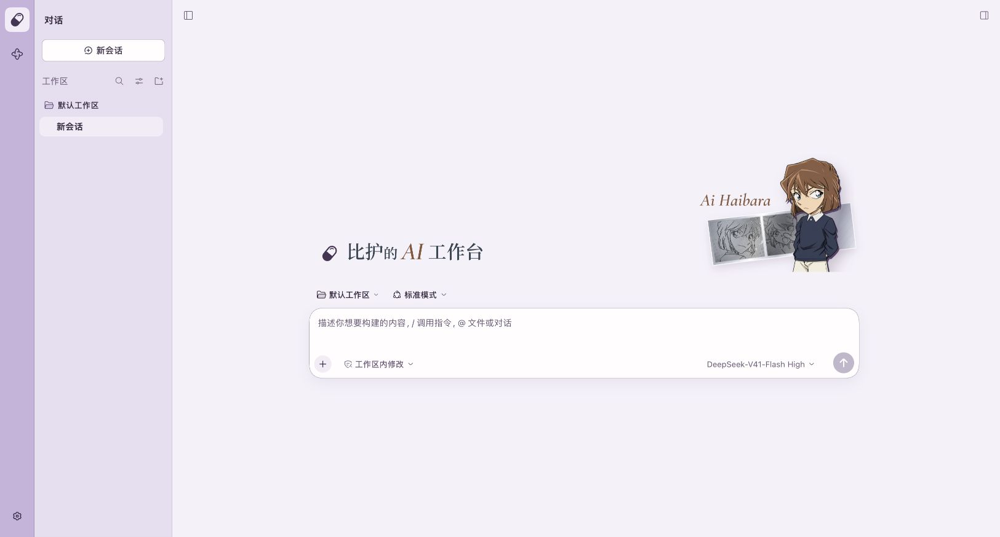
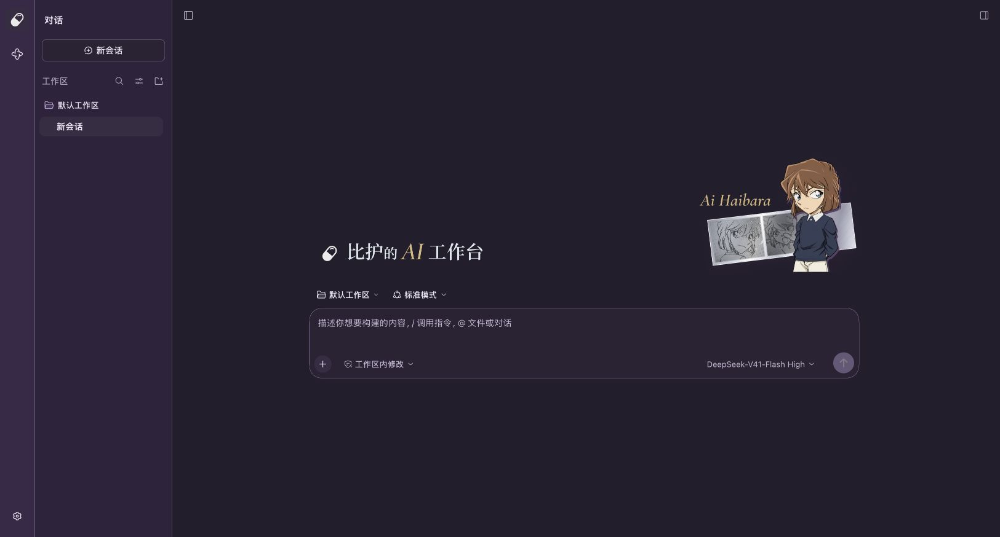
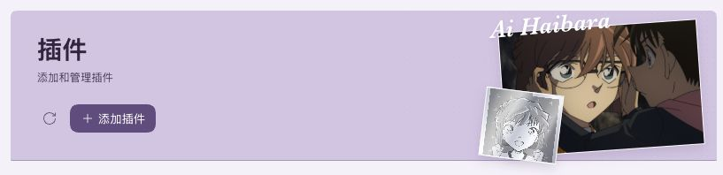
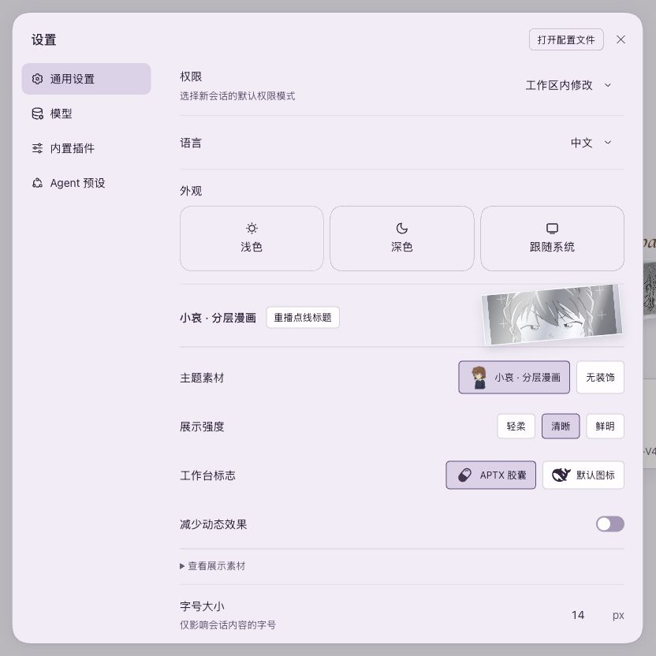
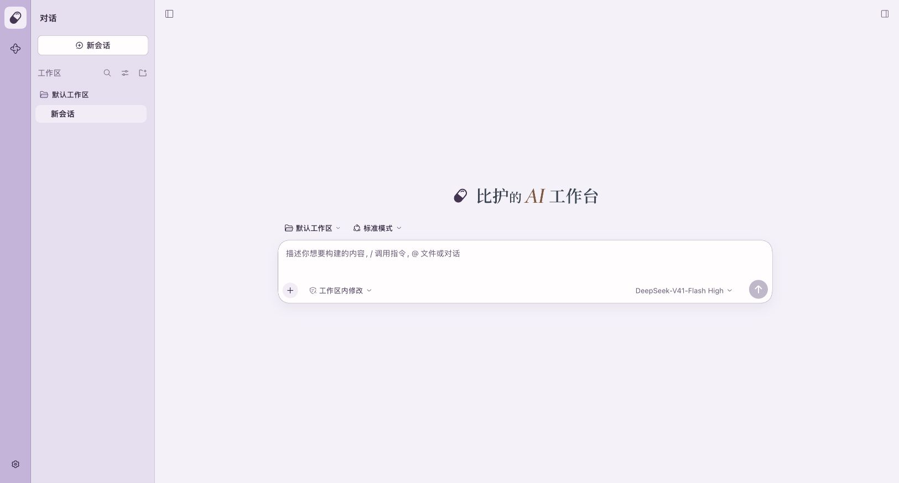

# 灰原哀主题 · DeepSeek Harness

为你的 AI 工作台换上冷紫与纸白的明暗配色，让小哀的立绘、漫画分镜和字标融进界面。需要专注时，也可以收起装饰。

**dsh-workbench-theme 1.3.3** · 官方 DeepSeek Harness Web **0.1.7-rc.2** · 可独立安装

[主题短片](#主题短片) · [功能与画面](#功能与画面) · [快速安装](#快速安装) · [制作其他角色主题](#制作其他角色主题) · [常见问题](#常见问题)



> 截图使用主题 1.3.3 与导航 1.11.2 的组合效果，内容为独立演示工作区。左侧紧凑应用栏来自 [Workbench 导航](https://github.com/lucky01222/dsh-workbench-shell)，主题本身不要求安装导航或其他业务插件。

## 主题短片

**从漫画分镜，进入你的工作台。** 38 秒横屏短片，展示人物构图、明暗观感、外观设置与无装饰状态。

<!-- theme-video:start -->

https://github.com/user-attachments/assets/4c2d7fb2-486b-4d6d-8fa2-f98550fa897f

<!-- theme-video:end -->

[下载完整 MP4 · 38 秒 · 1080p · 约 6.2 MB](media/theme-showcase.mp4) · [查看封面](media/theme-showcase-cover.jpg)

短片使用真实界面截图与现有主题素材制作；胶囊遮罩、界面分层和镜头转场属于视频后期。主题实际提供的设置与交互见下文。

## 功能与画面

### 浅色与深色，保持同一套气质

浅色以纸白和淡紫组织背景层级，深色转为冷紫与低亮度表面。文字、按钮、侧栏、浮层和选中状态使用成对的语义颜色，保留宿主原有的浅色、深色与跟随系统选项。

下面与首图为同一首页、同一构图的深色效果：



### 角色装饰，放在合适的位置

欢迎区展示立绘和分层漫画；页头使用电影分镜，侧栏可放彩稿，设置与助手区域使用银箔构图。不同位置采用不同的裁切、留白和尺寸，装饰不拦截点击。



设置里可以展开查看八种展示形式。它们是按页面位置安排的素材构图，不是八套独立主题。其他应用可以通过[通用外观协议](docs/appearance-contract.md)声明自己的装饰出口；未接入协议的页面不保证出现相同装饰。

### 外观设置，集中在一个地方

进入 **设置 → 通用 → 外观**，调整角色素材、展示强度、工作台标志和动态效果。



| 设置 | 可以调整什么 |
| --- | --- |
| 主题素材 | 小哀分层漫画，或无装饰 |
| 展示强度 | 轻柔、清晰、鲜明 |
| 工作台标志 | APTX 胶囊，或默认图标 |
| 减少动态效果 | 让动态表现保持静态 |

### 也可以，只留下配色与字标

选择“无装饰”后，人物与分镜退出，保留配色、所选标志和静态字标。文字、输入区与其他业务内容继续按原来的方式使用。



### 字标和浏览器标签，也有细节

- **首页字标**：中文名称使用 Noto Serif SC 600，`AI` 和 `Ai Haibara` 使用 Cormorant Garamond 600 真斜体。固定文字所需的字体子集随包加载，运行时不连接外部字体服务。
- **逐字响应**：鼠标经过支持的标题时，仅对应字形显示轮廓与锚点；离开约 500ms 后恢复。无装饰、减少动态效果、触屏、失焦和停用时回到静态文字。
- **浏览器标签**：显示“比护的 AI 工作台”或 `Bihu AI Workbench`，保留会话名称前缀和文档自定义标题。标签图标跟随标志选项，APTX 图标按系统明暗模式显示。

## 快速安装

需要 **Node.js 24** 和已安装的官方 **DSH 0.1.7-rc.2**。先停止目标 Web Profile，再安装并启动：

```sh
dsh plugin --profile web add dsh-workbench-theme
dsh web
```

首次使用：

1. 在浏览器打开 `dsh web` 打印的完整地址。
2. 进入“设置 → 通用 → 外观”，选择明暗、素材与强度。
3. 返回首页，查看字标、立绘和配色；需要简洁界面时选择“无装饰”。

用环境变量 `DSH_HOME` 指定目标数据目录。也可安装自己构建的包：

```sh
dsh plugin --profile web add /绝对路径/dsh-workbench-theme-1.3.3.tgz
```

## 和导航一起使用

主题负责配色、标志、字标和装饰；[Workbench 导航](https://github.com/lucky01222/dsh-workbench-shell)负责紧凑应用栏、独立对话列表和侧栏控制。

| 安装方式 | 获得的效果 |
| --- | --- |
| 只安装主题 | 在官方 Web 布局中使用主题外观 |
| 主题＋导航 | 使用本文截图中的紧凑工作台布局与角色外观 |

两者可按任意顺序安装和启停。停用主题后导航继续工作；停用导航后主题仍然可用。文档、资料库等业务能力由对应插件提供，不包含在主题包中。

## 制作其他角色主题

仓库提供 [DSH 角色主题制作 Skill](skills/dsh-character-theme/SKILL.md)。它把角色视觉设计、素材与字体处理、源码改造、偏好隔离和验证方法整理成可复用流程，帮助支持 Agent Skills 的编码助手制作新的独立主题。

在 Codex 中首次安装：下载本仓库后，在仓库根目录执行。已有同名 Skill 时先保留自定义内容。

```sh
mkdir -p "${CODEX_HOME:-$HOME/.codex}/skills"
cp -R skills/dsh-character-theme "${CODEX_HOME:-$HOME/.codex}/skills/"
```

新会话中的使用示例：

```text
使用 $dsh-character-theme，为我的原创角色“星旅者”制作 DSH 主题。
我提供了立绘和标志，希望使用深蓝与暖金的明暗配色，保留无装饰模式。
先核对 DSH 版本，在独立目录实现，并在隔离环境中验证。
```

其他支持 Agent Skills 的助手可将同一目录放入其 Skill 发现位置。Skill 不包含角色图片，也不会自动切换当前主题；新主题需准备自己的可用素材。当前架构同一 Web Profile 一次启用一个角色主题。

Skill 通过仓库 `skills/` 目录分发；`dsh plugin add dsh-workbench-theme` 只安装主题插件，不安装这份创作 Skill。

## 常见问题

**必须装导航或其他工作台插件吗？**

不需要，主题可独立安装。本文首图与短片使用了导航插件，因此会看到额外的紧凑应用栏。

**只喜欢配色，可以关闭人物和动画吗？**

可以。选“无装饰”收起人物和分镜；“减少动态效果”用于保留装饰但减少运动。需要默认品牌图标时再选择“默认图标”。

**停用或卸载后如何恢复？**

停用主题会释放其配色层、标志、门户、设置行和监听资源，恢复其他主题或官方默认。卸载命令如下，执行后重启目标 Profile：

```sh
dsh plugin --profile web remove dsh-workbench-theme
```

主题不拥有、修改或删除文档、会话和业务数据。

**换浏览器后提示需要认证怎么办？**

在新浏览器中打开当前 `dsh web` 启动时打印的完整地址。登录后地址栏会变为普通网址；把普通网址复制到另一个尚未登录的浏览器，不会自动携带登录状态。

**旧外观偏好会保留吗？**

旧版导航中的外观偏好会在首次发现时迁移一次到主题；已在新主题中做出的选择优先。远程浏览器按官方规则仅保留本次连接的临时偏好。

**支持其他 DSH 版本吗？**

当前仅明确适配官方 Web **0.1.7-rc.2**。升级宿主后需重新核对兼容性。升级或回退主题前，先停止目标 Profile 并备份配置；安装目标版本后，检查首页、插件页、明暗、无装饰以及停用与重新启用。

<details>
<summary>兼容机制与开发验证</summary>

主题通过官方 `theme.overrideTokens()` 注册共享颜色。浏览器标题投影绑定 rc.2 的持久 `<title>` 与产品后缀；官方首页和插件管理页有少量已核实的 DOM 适配。未知结构跳过，不改写业务数据。Client 样式在插入页面前标记所属插件，避免其他插件加载或热更新误移除 CSS。

```sh
npm ci --omit=peer
npm run build
npm run check
npm test
npm pack
```

构建后可以用 `DSH_RUNTIME_ROOT=/path/to/official-runtime npm run test:client` 在真实 rc.2 Loader/Cordis 下运行生命周期回归。与导航配对时需要另一包的构建产物，用 `DSH_PEER_PACKAGE_ROOT` 指定目录。这些测试使用内存 DOM，不代替浏览器界面验收。

进一步阅读：[通用外观协议](docs/appearance-contract.md) · [字体来源与子集](docs/fonts/README.md) · [README 展示素材](media/SOURCES.md)。

</details>

## 素材与许可

代码以 [MIT](LICENSE) 许可发布。**人物、漫画及相关第三方图片不在 MIT 许可范围内**，版权属于原权利方，本仓库不授予再分发或商用许可。README 截图与视频包含这些视觉素材，不改变其权利归属。字体为 SIL OFL 1.1 许可的子集。

来源与加工说明见 [THIRD_PARTY_NOTICES.md](THIRD_PARTY_NOTICES.md)、[字体记录](docs/fonts/README.md)及[展示素材说明](media/SOURCES.md)。
